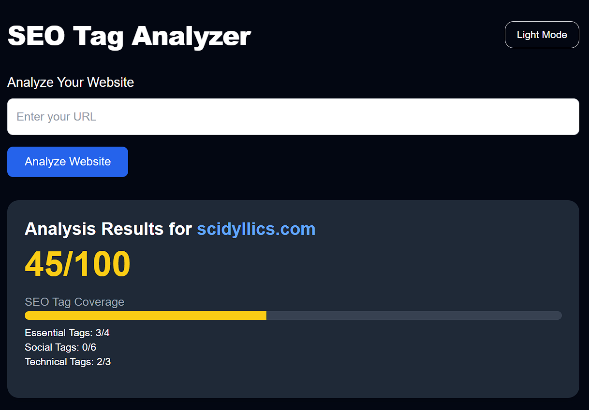

# SEO Analyzer UI

A modern frontend interface for analyzing the SEO health of any website. Built with **React**, **TailwindCSS**, and designed with dark mode, responsive cards, and a clean layout.



---

## 🚀 Features

- 🎯 SEO score, tag coverage, and performance metrics
- 🌙 Light/dark mode toggle
- 🧾 Lists of critical issues, warnings, and suggestions
- 📊 Visual layout using Tailwind utility classes
- 🐳 Docker-ready frontend for standalone or full-stack use

---

## 🧪 Local Development

```bash
# install dependencies
npm install

# start dev server
npm run dev
```

Visit [http://localhost:5173](http://localhost:5173) to see it in action.

---

## 📦 Build for Production

```bash
npm run build
```

This will output static assets to the `dist/` directory.

---

## 🐳 Docker (Optional)

```bash
# build docker image
docker build -t seo-analyzer-ui .

# run container
docker run -p 5173:5173 seo-analyzer-ui
```

---

## 🗂️ Project Structure

```
src/
├── components/
├── App.jsx
├── index.css
└── main.jsx
```

---

## 🛠️ Tech Stack

- [React 19](https://react.dev/)
- [TailwindCSS](https://tailwindcss.com/)
- [Vite](https://vitejs.dev/)
- [Docker](https://www.docker.com/) *(optional)*

---

## 📡 Connect to Backend

> Coming soon: `/analyze?url=...` endpoint powered by Node.js or .NET API.

---

## 📃 License

MIT © [Your Name](https://scidyllics.com)